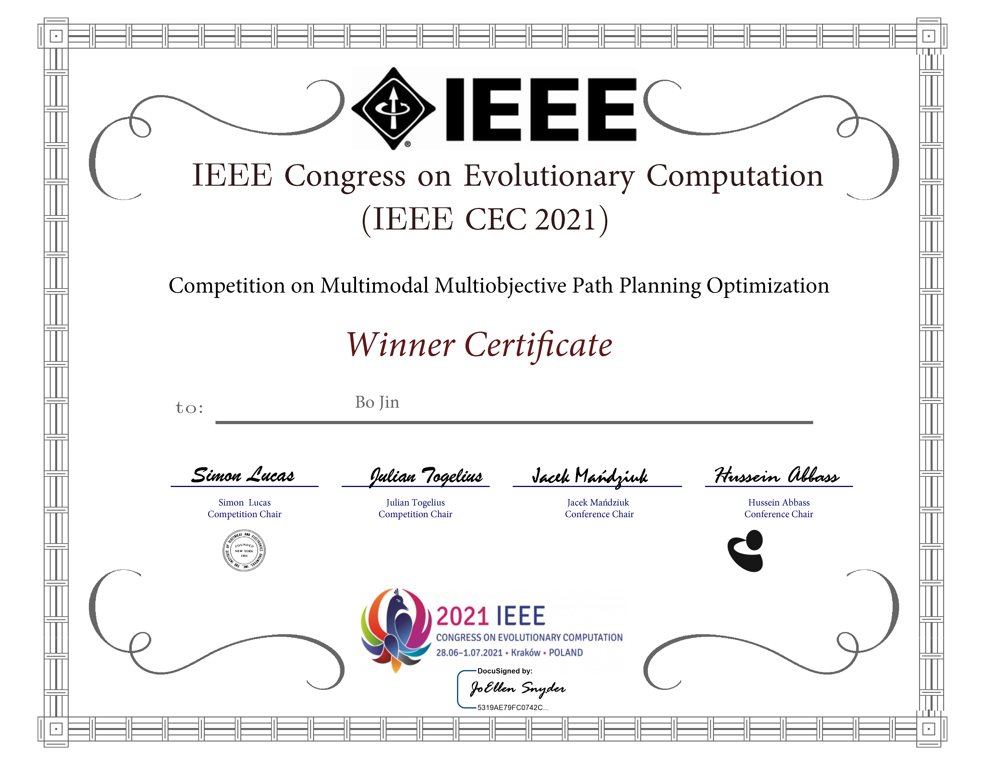

This project is part of the paper [Jin, B. (2021). Multi-objective A* algorithm for the multimodal multi-objective path planning optimization. In [*2021 IEEE Congress on Evolutionary Computation (CEC)*](https://doi.org/10.1109/CEC45853.2021.9504943), pp. 1704–1711].

This project is written in C++ 17.

Usage:
- `./solve`: solve the test problems
- `./solve <problem_file> <objective_list>`: solve a problem with specified objectives (`min_path_len`, `min_num_red`, `min_num_cross`, `min_f`)

Third-party libraries:
- [nlohmann/json](https://nlohmann.github.io/json/) 3.9.1
- [alandefreitas/pareto](https://alandefreitas.github.io/pareto/) 1.2.0

Cited by:
- Yao, X., Li, W., Pan, X., & Wang, R. (2022). Multimodal multi-objective evolutionary algorithm for multiple path planning. [*Computers & Industrial Engineering*](https://doi.org/10.1016/j.cie.2022.108145), 169, 108145.
